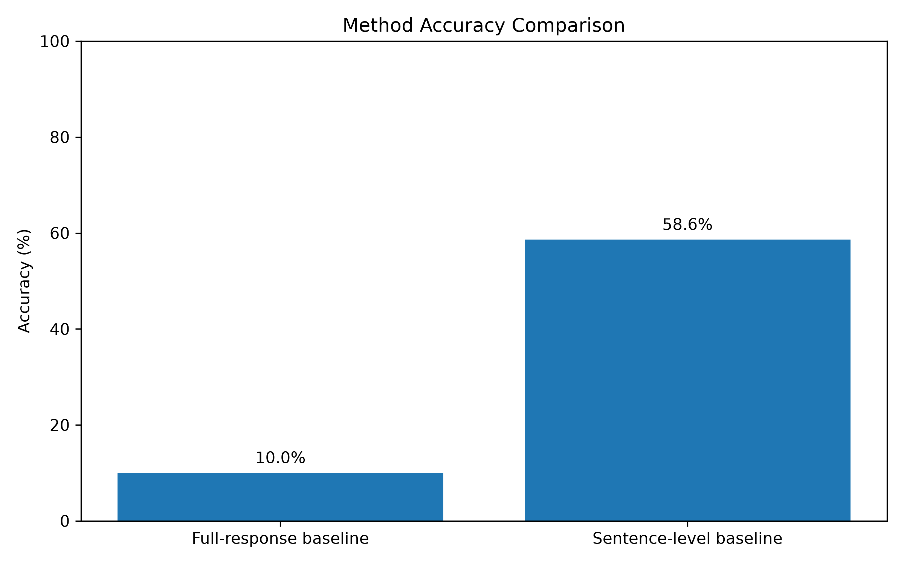
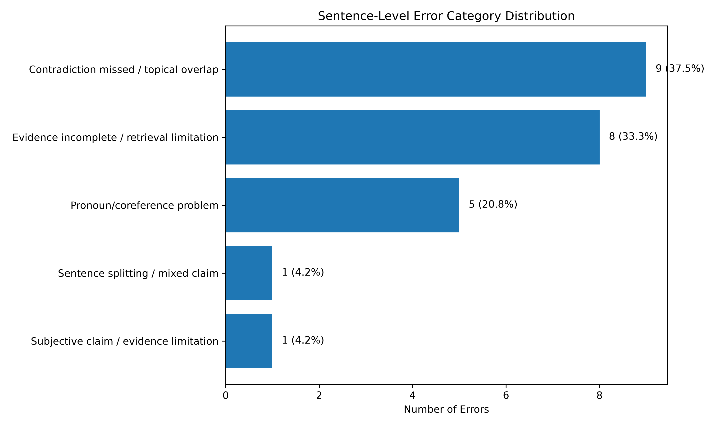

# Sentence-Level Evidence Verification for AI-Generated Responses

## Overview

This project investigates how AI-generated answers can be evaluated for factual reliability at the **sentence level**.

Instead of judging an entire AI response as correct or incorrect, this project splits each response into individual sentences, retrieves supporting evidence from Wikipedia, and checks whether each sentence is supported by the retrieved evidence.

The goal is to study whether sentence-level verification can provide more precise reliability feedback than full-response evaluation.

---

## Key Results

This project compares full-response verification with sentence-level verification.

| Method | Unit | Examples | Accuracy | Correct | Errors |
|---|---:|---:|---:|---:|---:|
| Full-response semantic similarity baseline | Full response | 20 | 10.0% | 2 | 18 |
| Sentence-level semantic similarity baseline | Sentence | 58 | 58.6% | 34 | 24 |

The full-response baseline performed poorly because it judged entire answers at once and often missed partial errors inside otherwise topic-relevant responses.

The sentence-level baseline provided more useful diagnostic information because it identified which specific sentences were unsupported or contradicted.



---

## Error Analysis

The largest failure mode was **contradiction missed / topical overlap**, where false claims were still semantically similar to the retrieved evidence because they shared the same topic words.

| Error Category | Count | Percentage |
|---|---:|---:|
| Contradiction missed / topical overlap | 9 | 37.50% |
| Evidence incomplete / retrieval limitation | 8 | 33.33% |
| Pronoun/coreference problem | 5 | 20.83% |
| Subjective claim / evidence limitation | 1 | 4.17% |
| Sentence splitting / mixed claim | 1 | 4.17% |



---

## Research Question

**How does sentence-level evidence verification compare with full-response verification for evaluating the factual reliability of AI-generated answers?**

This repository currently implements a sentence-level verification pipeline and evaluates a semantic similarity baseline.

---

## Why This Matters

AI-generated responses often contain a mix of correct and incorrect information. A response may be mostly accurate but still include one false or unsupported sentence.

For example, an answer may correctly identify a person but incorrectly state their birthplace, achievement, or historical context.

A full-response evaluation may not clearly show which part of the answer is unreliable. Sentence-level verification provides a more detailed view by identifying the specific sentence-level claims that may be unsupported or contradicted.

---

## Project Pipeline

The system follows this pipeline:

```text
AI-generated answer
↓
Sentence splitting
↓
Wikipedia evidence retrieval
↓
Semantic similarity baseline
↓
Gold label comparison
↓
Evaluation metrics
↓
Error analysis
```

Each AI-generated answer is split into sentence-level claims. Evidence is retrieved using a Wikipedia search query. The sentence and evidence are then compared using semantic similarity.

---

## Current Dataset

The project began with a small pilot dataset and was later expanded.

| Dataset Version | Questions | Sentence-Level Examples |
|---|---:|---:|
| Pilot dataset | 5 | 15 |
| Expanded dataset | 20 | 58 |

The expanded dataset includes factual questions from areas such as:

- Science
- History
- Literature
- Geography
- Biology
- Technology
- General knowledge

Some AI-generated answers intentionally include incorrect or unsupported claims so the system can be evaluated on both accurate and problematic sentences.

---

## Label Definitions

Each sentence-level claim is labeled as one of the following:

| Label | Meaning |
|---|---|
| `Supported` | The retrieved evidence clearly supports the sentence. |
| `Unsupported` | The retrieved evidence does not clearly prove the sentence. |
| `Contradicted` | The retrieved evidence conflicts with the sentence or shows that it is false. |

For binary evaluation, `Unsupported` and `Contradicted` were both treated as not-supported claims because the semantic similarity baseline only predicts `Supported` or `Unsupported`.

```text
Supported → Supported
Unsupported → Unsupported
Contradicted → Unsupported
```

---

## Baseline Method

The current baseline uses semantic similarity between each sentence and the retrieved Wikipedia evidence.

The model generates a similarity score and applies this rule:

```text
similarity_score >= 0.50 → Supported
similarity_score < 0.50 → Unsupported
```

This baseline is simple and useful for comparison, but it has an important limitation: semantic similarity measures relatedness, not factual truth.

A false sentence can still receive a high similarity score if it shares topic words with the evidence.

---

## Results

The expanded experiment evaluated the semantic similarity baseline on **58 sentence-level examples**.

### Gold Label Counts

| Label | Count |
|---|---:|
| Supported | 33 |
| Unsupported | 13 |
| Contradicted | 12 |
| Total | 58 |

### Evaluation Result

| Metric | Result |
|---|---:|
| Accuracy | 58.6% |
| Total examples | 58 |
| Correct predictions | 34 |
| Incorrect predictions | 24 |

### Classification Report

| Class | Precision | Recall | F1-score | Support |
|---|---:|---:|---:|---:|
| Supported | 0.596 | 0.848 | 0.700 | 33 |
| Unsupported | 0.545 | 0.240 | 0.333 | 25 |

### Confusion Matrix

```text
                    Predicted Supported    Predicted Unsupported
Actual Supported             28                     5
Actual Unsupported           19                     6
```

---

## Key Finding

The semantic similarity baseline performed better on supported claims than unsupported or contradicted claims.

The main issue was that the model often confused:

```text
topic similarity
```

with:

```text
factual support
```

This means the model frequently predicted `Supported` when the sentence and evidence were about the same topic, even if the sentence was not actually supported or was contradicted.

---

## Error Analysis

The expanded experiment produced 24 incorrect predictions.

The errors were categorized as follows:

| Error Category | Count |
|---|---:|
| Contradiction missed / topical overlap | 9 |
| Evidence incomplete / retrieval limitation | 8 |
| Pronoun/coreference problem | 5 |
| Subjective claim / evidence limitation | 1 |
| Sentence splitting / mixed claim | 1 |
| Total | 24 |

### Main Error Patterns

#### 1. Contradiction Missed / Topical Overlap

The most common error occurred when the sentence and evidence were about the same topic, but the sentence was factually wrong.

Example:

```text
Jupiter is smaller than Earth.
```

The evidence discusses Jupiter, so the texts are topically related. However, the claim is false.

#### 2. Evidence Incomplete / Retrieval Limitation

Some claims could not be verified because the retrieved Wikipedia summary did not contain enough information.

This shows that evidence retrieval quality strongly affects factual verification.

#### 3. Pronoun/Coreference Problem

Some sentences used pronouns such as “he” or “it.” When a sentence is separated from the full answer, the pronoun may lose context.

Example:

```text
He was born in Germany.
```

A stronger system may need coreference resolution to connect pronouns back to the correct entity.

#### 4. Subjective or Mixed Claims

Some claims used subjective wording or contained more than one factual claim in a single sentence. These cases are harder to evaluate with simple sentence-level similarity.

---

## Repository Structure

```text
summer_research_final/
├── README.md
├── requirements.txt
├── .gitignore
├── data/
│   ├── pilot_answers.csv
│   ├── simple_labeling_file.csv
│   ├── labeled_sentences_final.csv
│   ├── pilot_answers_pilot_backup.csv
│   └── labeled_sentences_pilot_backup.csv
├── src/
│   ├── split_sentences.py
│   ├── retrieve_evidence_by_question.py
│   ├── semantic_similarity_baseline.py
│   ├── create_simple_labeling_file.py
│   ├── evaluate_results.py
│   ├── create_error_analysis_file.py
│   └── summarize_errors.py
├── results/
│   ├── sentence_level_output.csv
│   ├── sentence_with_question_evidence.csv
│   ├── similarity_baseline_results.csv
│   ├── evaluation_report.csv
│   ├── confusion_matrix.csv
│   ├── evaluated_predictions.csv
│   ├── error_analysis_candidates.csv
│   ├── error_analysis_candidates_labeled_expanded.csv
│   └── error_analysis_summary_expanded.csv
├── notes/
│   ├── research_log.md
│   ├── pilot_experiment_log.md
│   └── expanded_experiment_log.md
└── report/
    └── final_report.md
```

---

## Setup Instructions

### 1. Clone the repository

```bash
git clone <repository-url>
cd summer_research_final
```

### 2. Create a virtual environment

```bash
python3 -m venv .venv
source .venv/bin/activate
```

### 3. Install dependencies

```bash
pip install -r requirements.txt
```

### 4. Download the spaCy English model

```bash
python -m spacy download en_core_web_sm
```

---

## How to Run the Pipeline

Run the scripts from the main project folder.

### Step 1: Split AI answers into sentences

```bash
python src/split_sentences.py
```

Output:

```text
results/sentence_level_output.csv
```

### Step 2: Retrieve Wikipedia evidence

```bash
python src/retrieve_evidence_by_question.py
```

Output:

```text
results/sentence_with_question_evidence.csv
```

### Step 3: Run semantic similarity baseline

```bash
python src/semantic_similarity_baseline.py
```

Output:

```text
results/similarity_baseline_results.csv
```

### Step 4: Create simple labeling file

```bash
python src/create_simple_labeling_file.py
```

Output:

```text
data/simple_labeling_file.csv
```

### Step 5: Evaluate predictions

```bash
python src/evaluate_results.py
```

Outputs:

```text
results/evaluation_report.csv
results/confusion_matrix.csv
results/evaluated_predictions.csv
```

### Step 6: Create error analysis file

```bash
python src/create_error_analysis_file.py
```

Output:

```text
results/error_analysis_candidates.csv
```

---

## Important Notes

- The project uses Wikipedia summaries as the evidence source.
- The semantic similarity baseline is intentionally simple and used as a starting point.
- The current evaluation is based on a small undergraduate research dataset.
- Results should be interpreted as a prototype-level experiment, not a large-scale benchmark.
- Some output files may be overwritten when the pipeline is rerun.

---

## Limitations

This project has several limitations:

1. The expanded dataset contains 58 sentence-level examples, which is useful for a prototype but still small.
2. Wikipedia summaries may not contain enough evidence for every claim.
3. Semantic similarity cannot reliably detect contradictions.
4. Sentence-level verification can lose context when a sentence uses pronouns.
5. Some sentences contain multiple claims, which may require claim-level decomposition rather than sentence-level splitting.

---

## Future Work

Future improvements could include:

- Adding a Natural Language Inference model for contradiction-aware verification.
- Comparing sentence-level verification with full-response verification.
- Expanding the dataset to hundreds or thousands of examples.
- Retrieving multiple evidence passages instead of only Wikipedia summaries.
- Adding coreference resolution for pronouns.
- Building an interactive demo where users can enter a question and receive sentence-level factuality labels.
- Highlighting supported, unsupported, and contradicted sentences in a user interface.

---

## Project Status

Current status:

```text
Completed: sentence-level verification pipeline
Completed: semantic similarity baseline
Completed: expanded dataset evaluation
Completed: error analysis
In progress: final research report
Planned: stronger NLI-based verification method
```

---

## Main Takeaway

This project shows that sentence-level verification can identify specific unreliable parts of AI-generated answers.

However, the semantic similarity baseline alone is not sufficient for reliable factual verification because it often confuses topic similarity with factual support.

A stronger verification system should combine better evidence retrieval with contradiction-aware models such as Natural Language Inference.

---

## Run the Interactive VeriClaim Demo

This repository includes a Streamlit demo for evidence-grounded verification of LLM-generated claims.

The demo allows a user to enter:

- a question
- an AI-generated answer
- a Wikipedia evidence query

The app then:

1. splits the answer into sentence-level claims,
2. retrieves Wikipedia evidence,
3. runs Natural Language Inference verification,
4. shows whether each claim is Supported, Contradicted, or has Insufficient Evidence,
5. displays NLI confidence scores and semantic similarity scores.

### Run the app

From the main project folder, run:

```bash
python -m streamlit run app/app.py